# Class diagram & deployment guidance

This file contains a class diagram (Mermaid) for the e‑commerce backend and concise guidance on two choices you asked about:

1) Multi‑vendor (marketplace) vs single‑vendor (platform only)
2) Object storage: S3 (managed) vs self‑hosted (MinIO / on‑prem)

Use this document as a living reference while implementing the backend. The diagram is written in Mermaid so you can view it in many editors or renderers.

---

## Mermaid class diagram

```mermaid
classDiagram
    direction TB

    %% Users and Roles
    class User {
      +Long id
      +String email
      +String passwordHash
      +String fullName
      +boolean enabled
      +Date createdAt
    }
    class Role { +String name }
    User o-- "*" Role : has

    class Address {
      +Long id
      +String line1
      +String line2
      +String city
      +String administrativeArea
      +String administrativeAreaCode // ISO 3166-2 (e.g. US-CA, BR-SP)
      +String postalCode
      +String country
      
    }
    User "1" o-- "*" Address : addresses

    %% Seller (marketplace)
    class Seller {
      +Long id
      +Long userId
      +String companyName
      +String contactEmail
      +String taxId
      +SellerStatus status
    }
    Seller "1" --> "1" User : owner

    %% Catalog
    class Category { +Long id +String name +String slug +Long parentId }
    class Product {
      +Long id
      +Long sellerId (nullable) // null = platform
      +String sku
      +String name
      +String description
      +BigDecimal basePrice
      +String currency
      +boolean active
      +ProductStatus status
    }
    class ProductVariant {
      +Long id
      +Long productId
      +String sku
      +Map<String,String> attributes
      +BigDecimal priceOverride
      +Integer stock
    }
    class ProductImage { +Long id +Long productId +String url +String altText +Integer position }

    Category "1" o-- "*" Product : categories
    Product "1" o-- "*" ProductVariant : variants
    Product "1" o-- "*" ProductImage : images
    Seller "1" o-- "*" Product : owns

    %% Inventory
    class InventoryTransaction { +Long id +Long productVariantId +int delta +String reason +Date createdAt }
    ProductVariant "1" o-- "*" InventoryTransaction : transactions

    %% Cart and Orders
    class Cart { +UUID id +Long userId (nullable) +Date updatedAt }
    class CartItem { +Long id +Long cartId +Long productVariantId +int quantity +BigDecimal priceSnapshot }
    Cart "1" o-- "*" CartItem : items

    class Order { +Long id +Long userId +BigDecimal subtotal +BigDecimal shipping +BigDecimal tax +BigDecimal total +String status +Date createdAt }
    class OrderItem { +Long id +Long orderId +Long productVariantId +int quantity +BigDecimal priceSnapshot +BigDecimal lineTotal }
    Order "1" o-- "*" OrderItem : items

    User "1" o-- "*" Order : orders

    %% Payments
    class Payment { +Long id +Long orderId +String provider +String providerPaymentId +PaymentStatus status +BigDecimal amount +Date createdAt }
    Order "1" o-- "*" Payment : payments

    %% Storage abstraction
    class MediaAsset {
      +Long id
      +String storageKey
      +String url
      +String contentType
      +Long size
      +Date createdAt
    }
    ProductImage "1" o-- "1" MediaAsset : asset

    %% Shipping
    class Shipment { +Long id +Long orderId +String carrier +String trackingNumber +ShipmentStatus status }
    Order "1" o-- "*" Shipment : shipments

    %% Reviews & Coupons
    class Review { +Long id +Long productId +Long userId +int rating +String title +String body +Date createdAt }
    Product "1" o-- "*" Review : reviews
    User "1" o-- "*" Review : reviews

    class Coupon { +Long id +String code +String type +BigDecimal value +Date validFrom +Date validUntil +int usageLimit }

    %% Audit mixin (conceptual)
    class Audit { +String createdBy +Date createdAt +String updatedBy +Date updatedAt }
    Product --|> Audit
    Order --|> Audit
    User --|> Audit

    %% Notes
    note for Seller "Seller optional: if you want marketplace, enable seller flow and per-seller product ownership."
    note for MediaAsset "MediaAsset.storageKey is the object key in S3/MinIO; url is CDN or signed URL. Store only keys/URLs in DB."
    note for Address "Contact phone is stored on User.phone by default; add per-address phone only if necessary."

    %% Enum definitions
    class SellerStatus {
      <<enumeration>>
      +PENDING
      +VERIFIED
      +SUSPENDED
    }

    class ProductStatus {
      <<enumeration>>
      +DRAFT
      +SUBMITTED
      +PUBLISHED
      +SUSPENDED
      +REMOVED
    }

    class OrderStatus {
      <<enumeration>>
      +CREATED
      +PAID
      +PROCESSING
      +SHIPPED
      +DELIVERED
      +CANCELLED
      +REFUNDED
    }

    class PaymentStatus {
      <<enumeration>>
      +PENDING
      +SUCCEEDED
      +FAILED
      +REFUNDED
    }

    class ShipmentStatus {
      <<enumeration>>
      +PENDING
      +SHIPPED
      +IN_TRANSIT
      +DELIVERED
      +RETURNED
    }
```



---

## 1) Multi‑vendor vs Single‑vendor — recommendation and implications

- Single‑vendor (platform only)
  - Simpler: products created/managed by platform admins.
  - Easier billing, shipping, and payments; all funds go to platform account.
  - Good to start if you just want a store.

- Multi‑vendor (marketplace, like MercadoLibre)
  - Vendors (sellers) have accounts and can publish products.
  - Requires: vendor onboarding & verification, product moderation, per‑vendor dashboards, commission model, payouts, dispute handling.
  - Payments: choose between platform‑captured payments (platform receives funds then pays vendors) or direct payments (split payments/Connect). Stripe Connect supports marketplaces.
  - Compliance & KYC: may be required depending on region.

Recommendation:
- If you plan to evolve into a marketplace, design the data model for multi‑vendor from the start (add `vendorId` nullable on `Product`) but implement MVP flows for platform‑managed products first. This keeps code flexible without full marketplace complexity initially.

Practical notes when enabling vendors:
- Product lifecycle: DRAFT -> SUBMITTED -> PUBLISHED (admin review optional) -> SUSPENDED
- Vendor quotas, product limits, moderation queues
- Audit trails: who published/edited product

## 2) Object storage: S3 (managed) vs self‑hosted (MinIO) — tradeoffs

Options:
- AWS S3 / DigitalOcean Spaces / Google Cloud Storage (managed)
  - Pros: highly available, scalable, low ops, integrated with CDN, simple lifecycle/replication, pay per use.
  - Cons: ongoing costs; egress costs if heavy downloads; vendor lock‑in.

- Self‑hosted S3 compatible (MinIO, Ceph)
  - Pros: lower recurring cloud costs if you control infrastructure; full control over data location and egress.
  - Cons: requires ops, backups, scaling, high‑availability planning; more initial setup time.

Recommended approach for cost and simplicity:
- Start with S3‑compatible managed storage (AWS S3 / DigitalOcean Spaces). Use CDN (CloudFront, Fastly, Cloudflare) in front of buckets to reduce egress and improve performance.
- For local dev use MinIO (S3 compatible) via Docker Compose.
- Abstract storage behind a `StorageService` interface in code. Provide `S3StorageService` and `LocalStorageService` implementations.

Storage design guidelines:
- Store only `MediaAsset.storageKey` (object key) and metadata in DB; never store binary in DB.
- Use pre-signed URLs for private content or store public URLs via CDN for public assets.
- Generate thumbnails on upload (background job) or on‑the‑fly via image service or CDN resizing to save storage and bandwidth.
- Protect uploads with server-side validation (file type, size) and virus scanning if needed.

Cost tips:
- Use lifecycle rules to move older unused images to cheaper storage or delete unused uploads.
- Use regional buckets near users to reduce latency and egress costs.

## 3) Code design suggestions (storage + vendor)

- Define `StorageService` interface:

```java
public interface StorageService {
  String upload(InputStream data, String contentType, String keyHint);
  URL getUrl(String storageKey, Duration ttl);
  void delete(String storageKey);
}
```

- Implementations:
  - `S3StorageService` (production)
  - `MinioStorageService` / `LocalStorageService` (dev/test)

- Use a `MediaAsset` entity to store metadata and the storage key. Use the `url` field to store CDN URL or leave null and compute signed URLs at runtime.

## 4) Normalization recommendations (DB)

- Normalize `ProductVariant`, `ProductImage`, `OrderItem`, `Address` as separate tables. This simplifies queries, indexing and avoids large JSON blobs.
- Use `sku` unique index on `products` or `product_variants` as appropriate.
- Use FK constraints for referential integrity and add indexes on frequently queried fields (vendorId, categoryId, createdAt).

## 5) Quick implementation checklist (backend tasks)

- [ ] Add `Vendor` entity (nullable on Product) and vendor onboarding endpoints.
- [ ] Create `MediaAsset` entity and `StorageService` abstraction.
- [ ] Implement `S3StorageService` and `MinioStorageService`.
- [ ] Ensure `ProductVariant`, `OrderItem`, `Address` normalized tables exist.
- [ ] Add lifecycle for product status (draft/submitted/published).
- [ ] Implement admin moderation endpoints (approve/reject products).
- [ ] Integrate Stripe Connect later if marketplace needs direct payouts.

---

If you want, I can now:
- generate Java entity classes and repositories for `Vendor`, `Product`, `ProductVariant`, `MediaAsset`, `Order` and `OrderItem`, plus Flyway migrations (SQL) skeletons; or
- export this Mermaid diagram into `docs/diagrams/class-diagram.mmd` and render a PNG (if the environment supports it).

Which should I do next? (generate code, add migrations, or export diagram image?)

## Implementation notes (names & conventions)

- Use English for field names and DTOs: `vendorId`, `productVariantId`, `storageKey`, `clientSecret`.
- Code style: camelCase for Java/TS fields and methods; snake_case for DB column names if preferred.
- Indexes to add early: unique index on `sku`, indexes on `vendor_id`, `category_id`, `created_at`.

## Next steps I can do for you

- Generate Java entity classes + Spring Data repositories + basic services/controllers for: `Vendor`, `Product`, `ProductVariant`, `MediaAsset`, `Order`, `OrderItem`.
- Generate Flyway migration skeletons under `src/main/resources/db/migration` (SQL files creating tables and SKU unique indexes).
- Create a `backend/README.md` with Docker Compose commands and dev run instructions.

Tell me which of the three above you want me to generate now and I will create the files.
