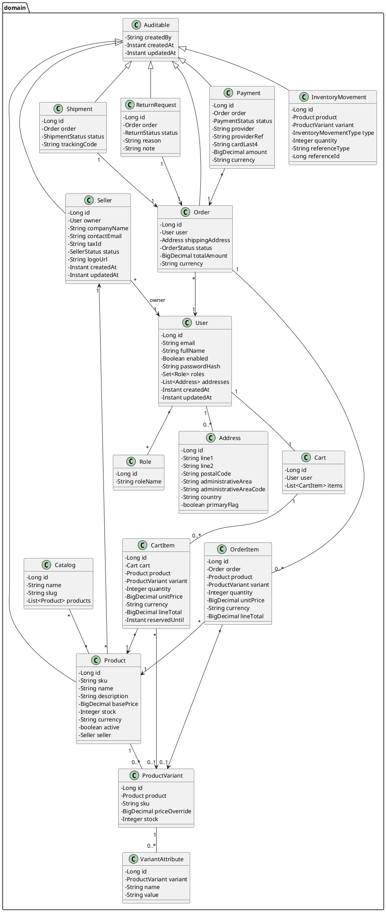

# Vista Logica (Clases Backend)

```plantuml
@startuml
skinparam classAttributeIconSize 0
# Vista Logica (Clases Backend)

```plantuml
@startuml
skinparam classAttributeIconSize 0

package "domain" {
  class Auditable {
    - String createdBy
    - Instant createdAt
    - Instant updatedAt
  }

  class User {
    - Long id
    - String email
    - String fullName
    - Boolean enabled
    - String passwordHash
    - Set<Role> roles
    - List<Address> addresses
    - Instant createdAt
    - Instant updatedAt
  }

  class Role {
    - Long id
    - String roleName
  }

  class Address {
    - Long id
    - String line1
    - String line2
    - String postalCode
    - String administrativeArea
    - String administrativeAreaCode
    - String country
    - boolean primaryFlag
  }

  class Seller {
    - Long id
    - User owner
    - String companyName
    - String contactEmail
    - String taxId
    - SellerStatus status
    - String logoUrl
    - Instant createdAt
    - Instant updatedAt
  }

  class Product {
    - Long id
    - String sku
    - String name
    - String description
    - BigDecimal basePrice
    - Integer stock
    - String currency
    - boolean active
    - Seller seller
  }

  class ProductVariant {
    - Long id
    - Product product
    - String sku
    - BigDecimal priceOverride
    - Integer stock
  }

  class VariantAttribute {
    - Long id
    - ProductVariant variant
    - String name
    - String value
  }

  class Catalog {
    - Long id
    - String name
    - String slug
    - List<Product> products
  }

  class Cart {
    - Long id
    - User user
    - List<CartItem> items
  }

  class CartItem {
    - Long id
    - Cart cart
    - Product product
    - ProductVariant variant
    - Integer quantity
    - BigDecimal unitPrice
    - String currency
    - BigDecimal lineTotal
    - Instant reservedUntil
  }

  class Order {
    - Long id
    - User user
    - Address shippingAddress
    - OrderStatus status
    - BigDecimal totalAmount
    - String currency
  }

  class OrderItem {
    - Long id
    - Order order
    - Product product
    - ProductVariant variant
    - Integer quantity
    - BigDecimal unitPrice
    - String currency
    - BigDecimal lineTotal
  }

  class Payment {
    - Long id
    - Order order
    - PaymentStatus status
    - String provider
    - String providerRef
    - String cardLast4
    - BigDecimal amount
    - String currency
  }

  class Shipment {
    - Long id
    - Order order
    - ShipmentStatus status
    - String trackingCode
  }

  class ReturnRequest {
    - Long id
    - Order order
    - ReturnStatus status
    - String reason
    - String note
  }

  class InventoryMovement {
    - Long id
    - Product product
    - ProductVariant variant
    - InventoryMovementType type
    - Integer quantity
    - String referenceType
    - Long referenceId
  }

}

' Domain relationships
User "1" -- "0..*" Address
User "*" -- "*" Role
Seller "*" --> "1" User : owner
Product "*" --> "1" Seller
Product "1" -- "0..*" ProductVariant
ProductVariant "1" -- "0..*" VariantAttribute
Catalog "*" -- "*" Product
User "1" -- "1" Cart
Cart "1" -- "0..*" CartItem
CartItem "*" --> "1" Product
CartItem "*" --> "0..1" ProductVariant
Order "*" --> "1" User
Order "1" -- "0..*" OrderItem
OrderItem "*" --> "1" Product
OrderItem "*" --> "0..1" ProductVariant
Payment "*" --> "1" Order
Shipment "1" --> "1" Order
ReturnRequest "1" --> "1" Order
Auditable <|-- Seller
Auditable <|-- Product
Auditable <|-- Order
Auditable <|-- Payment
Auditable <|-- Shipment
Auditable <|-- InventoryMovement
Auditable <|-- ReturnRequest

@enduml
```
Payment "*" --> "1" Order
