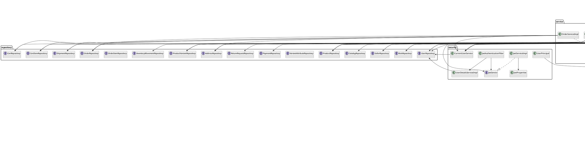

# Vista Logica (Clases Backend)

```plantuml
@startuml
skinparam classAttributeIconSize 0

package "controller" {
  class AuthController
  class ProductController
  class ProductVariantController
  class SellerController
  class CatalogController
  class ProfileController
  class CartController
  class OrderController
  class PaymentController
  class ShipmentController
  class ReturnController
}

package "service" {
  interface AuthService
  class AuthServiceImpl
  interface ProductService
  class ProductServiceImpl
  interface ProductVariantService
  class ProductVariantServiceImpl
  interface SellerService
  class SellerServiceImpl
  interface CatalogService
  class CatalogServiceImpl
  interface ProfileService
  class ProfileServiceImpl
  interface CartService
  class CartServiceImpl
  interface OrderService
  class OrderServiceImpl
  interface PaymentService
  class PaymentServiceImpl
  interface ShipmentService
  class ShipmentServiceImpl
  interface InventoryService
  class InventoryServiceImpl
  interface ReturnService
  class ReturnServiceImpl
}

package "service.payment" {
  interface CardValidator
  class LuhnCardValidator
}

package "security" {
  class JwtAuthenticationFilter
  class JwtServiceImpl
  interface JwtService
  class JwtProperties
  class UserDetailsServiceImpl
  class UserPrincipal
  class CurrentUserService
}

package "repository" {
  interface UserRepository
  interface RoleRepository
  interface SellerRepository
  interface ProductRepository
  interface ProductVariantRepository
  interface VariantAttributeRepository
  interface CatalogRepository
  interface AddressRepository
  interface CartRepository
  interface CartItemRepository
  interface OrderRepository
  interface OrderItemRepository
  interface PaymentRepository
  interface ShipmentRepository
  interface InventoryMovementRepository
  interface ReturnRequestRepository
}

package "domain" {
  class User
  class Role
  class Address
  class Seller
  class Product
  class ProductVariant
  class VariantAttribute
  class Catalog
  class Cart
  class CartItem
  class Order
  class OrderItem
  class Payment
  class Shipment
  class InventoryMovement
  class ReturnRequest
  class Auditable
}

' Relationships - layers
AuthController --> AuthService
ProductController --> ProductService
ProductVariantController --> ProductVariantService
SellerController --> SellerService
CatalogController --> CatalogService
ProfileController --> ProfileService
CartController --> CartService
OrderController --> OrderService
PaymentController --> PaymentService
ShipmentController --> ShipmentService
ReturnController --> ReturnService

AuthServiceImpl ..|> AuthService
ProductServiceImpl ..|> ProductService
ProductVariantServiceImpl ..|> ProductVariantService
SellerServiceImpl ..|> SellerService
CatalogServiceImpl ..|> CatalogService
ProfileServiceImpl ..|> ProfileService
CartServiceImpl ..|> CartService
OrderServiceImpl ..|> OrderService
PaymentServiceImpl ..|> PaymentService
ShipmentServiceImpl ..|> ShipmentService
InventoryServiceImpl ..|> InventoryService
ReturnServiceImpl ..|> ReturnService

AuthServiceImpl --> UserRepository
AuthServiceImpl --> RoleRepository
AuthServiceImpl --> JwtService
AuthServiceImpl --> CurrentUserService
ProductServiceImpl --> ProductRepository
ProductServiceImpl --> SellerRepository
ProductServiceImpl --> CurrentUserService
ProductVariantServiceImpl --> ProductRepository
ProductVariantServiceImpl --> ProductVariantRepository
ProductVariantServiceImpl --> CurrentUserService
SellerServiceImpl --> SellerRepository
SellerServiceImpl --> RoleRepository
SellerServiceImpl --> UserRepository
SellerServiceImpl --> CurrentUserService
CatalogServiceImpl --> CatalogRepository
CatalogServiceImpl --> ProductRepository
ProfileServiceImpl --> UserRepository
ProfileServiceImpl --> AddressRepository
ProfileServiceImpl --> CurrentUserService
CartServiceImpl --> CartRepository
CartServiceImpl --> CartItemRepository
CartServiceImpl --> ProductRepository
CartServiceImpl --> ProductVariantRepository
CartServiceImpl --> CurrentUserService
OrderServiceImpl --> CartRepository
OrderServiceImpl --> CartItemRepository
OrderServiceImpl --> OrderRepository
OrderServiceImpl --> ShipmentRepository
OrderServiceImpl --> AddressRepository
OrderServiceImpl --> CurrentUserService
PaymentServiceImpl --> OrderRepository
PaymentServiceImpl --> PaymentRepository
PaymentServiceImpl --> CurrentUserService
PaymentServiceImpl --> CardValidator
ShipmentServiceImpl --> ShipmentRepository
ShipmentServiceImpl --> OrderRepository
ShipmentServiceImpl --> CurrentUserService
InventoryServiceImpl --> InventoryMovementRepository
InventoryServiceImpl --> ProductRepository
InventoryServiceImpl --> ProductVariantRepository
ReturnServiceImpl --> OrderRepository
ReturnServiceImpl --> ReturnRequestRepository
ReturnServiceImpl --> PaymentService
ReturnServiceImpl --> CurrentUserService

JwtAuthenticationFilter --> JwtService
JwtAuthenticationFilter --> UserDetailsServiceImpl
UserDetailsServiceImpl --> UserRepository
CurrentUserService --> UserRepository
JwtServiceImpl ..|> JwtService
JwtServiceImpl --> JwtProperties
UserPrincipal --> User
LuhnCardValidator ..|> CardValidator

' Relationships - domain
User "1" -- "0..*" Address
User "*" -- "*" Role
Seller "*" --> "1" User : owner
Product "*" --> "1" Seller
Product "1" -- "0..*" ProductVariant
ProductVariant "1" -- "0..*" VariantAttribute
Catalog "*" -- "*" Product
User "1" -- "1" Cart
Cart "1" -- "0..*" CartItem
CartItem "*" --> "1" Product
CartItem "*" --> "0..1" ProductVariant
Order "*" --> "1" User
Order "1" -- "0..*" OrderItem
OrderItem "*" --> "1" Product
OrderItem "*" --> "0..1" ProductVariant
Payment "*" --> "1" Order
Shipment "1" --> "1" Order
ReturnRequest "1" --> "1" Order
Auditable <|-- Seller
Auditable <|-- Product
Auditable <|-- Order
Auditable <|-- Payment
Auditable <|-- Shipment
Auditable <|-- InventoryMovement
Auditable <|-- ReturnRequest

@enduml
```
