# Vista de Desarrollo (Componentes y carpetas)

```plantuml
@startuml
skinparam componentStyle rectangle

package "Frontend (Angular)" {
  package "app" {
    [app.ts]
    [app.html]
    [app.scss]
    [app.routes.ts]
    [app.routes.server.ts]
    [app.config.ts]
    [app.config.server.ts]
  }

  package "entrypoints" {
    [main.ts]
    [main.server.ts]
    [server.ts]
    [index.html]
    [styles.scss]
    [environments/environment.ts]
  }

  package "features" {
    [home]
    [catalog]
    [product-detail]
    [checkout]
    [order-detail]
    [profile]
    [auth/login]
    [auth/register]
    [admin-returns]
    [admin-shipments]
  }

  package "core" {
    [guards/auth.guard]
    [interceptors/auth.interceptor]
    [services/auth.service]
    [services/cart.service]
    [services/catalog.service]
    [services/order.service]
    [services/payment.service]
    [services/profile.service]
    [services/shipment.service]
    [services/return.service]
    [services/toast.service]
    [models/*]
  }

  package "shared" {
    [components/empty-state]
    [components/skeleton-card]
    [components/toast]
    [validators/security.validators]
  }
}

package "Backend (Spring Boot)" {
  package "app" {
    [BackendApplication]
  }

  package "config" {
    [DataLoader]
    [SecurityConfig]
    [JpaConfig]
  }

  package "controller" {
    [AuthController]
    [ProductController]
    [ProductVariantController]
    [SellerController]
    [CatalogController]
    [ProfileController]
    [CartController]
    [OrderController]
    [PaymentController]
    [ShipmentController]
    [ReturnController]
  }

  package "service" {
    [AuthService]
    [ProductService]
    [ProductVariantService]
    [SellerService]
    [CatalogService]
    [ProfileService]
    [CartService]
    [OrderService]
    [PaymentService]
    [ShipmentService]
    [ReturnService]
    [InventoryService]
  }

  package "repository" {
    [UserRepository]
    [RoleRepository]
    [SellerRepository]
    [ProductRepository]
    [ProductVariantRepository]
    [VariantAttributeRepository]
    [CatalogRepository]
    [AddressRepository]
    [CartRepository]
    [CartItemRepository]
    [OrderRepository]
    [OrderItemRepository]
    [PaymentRepository]
    [ShipmentRepository]
    [InventoryMovementRepository]
    [ReturnRequestRepository]
  }

  package "exception" {
    [ErrorResponse]
    [GlobalExceptionHandler]
    [BadRequestException]
    [UnauthorizedException]
    [ResourceNotFoundException]
    [DuplicateResourceException]
  }

  package "domain" {
    [User]
    [Role]
    [Address]
    [Seller]
    [Product]
    [ProductVariant]
    [VariantAttribute]
    [Catalog]
    [Cart]
    [CartItem]
    [Order]
    [OrderItem]
    [Payment]
    [Shipment]
    [InventoryMovement]
    [ReturnRequest]
    [Auditable]
  }

  package "security" {
    [JwtAuthenticationFilter]
    [JwtService]
    [UserDetailsService]
    [CurrentUserService]
  }
}

' Feature -> client service usage
[home] --> [services/catalog.service]
[catalog] --> [services/catalog.service]
[product-detail] --> [services/catalog.service]
[checkout] --> [services/order.service]
[checkout] --> [services/payment.service]
[order-detail] --> [services/order.service]
[profile] --> [services/profile.service]
[auth/login] --> [services/auth.service]
[auth/register] --> [services/auth.service]
[admin-returns] --> [services/return.service]
[admin-shipments] --> [services/shipment.service]

' Client services -> backend controllers
[services/auth.service] --> [AuthController]
[services/cart.service] --> [CartController]
[services/catalog.service] --> [CatalogController]
[services/order.service] --> [OrderController]
[services/payment.service] --> [PaymentController]
[services/profile.service] --> [ProfileController]
[services/shipment.service] --> [ShipmentController]
[services/return.service] --> [ReturnController]

' Backend internal wiring (high level)
[OrderController] --> [OrderService]
[OrderService] --> [OrderRepository]
[PaymentController] --> [PaymentService]
[PaymentService] --> [PaymentRepository]
[ShipmentController] --> [ShipmentService]
[ShipmentService] --> [ShipmentRepository]
[ReturnController] --> [ReturnService]
[ReturnService] --> [ReturnRequestRepository]

@enduml
```

Notes:
- Esta vista sigue la estructura de carpetas y paquetes del codigo.
- Incluye frontend y backend para reflejar el flujo completo de componentes.
