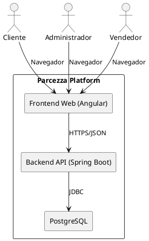

# Vista de Contexto

```plantuml
@startuml
skinparam componentStyle rectangle

actor "Cliente" as Cliente
actor "Administrador" as Admin
actor "Vendedor" as Seller

rectangle "Parcezza Platform" as System {
  [Frontend Web (Angular)] as FE
  [Backend API (Spring Boot)] as BE
  [PostgreSQL] as DB
}

Cliente --> FE : Navegador
Admin --> FE : Navegador
Seller --> FE : Navegador

FE --> BE : HTTPS/JSON
BE --> DB : JDBC

@enduml
```

Notes:
- Vista de limites del sistema y actores externos.
- Si hay integraciones externas (pagos, notificaciones), las agrego aqui cuando existan.
