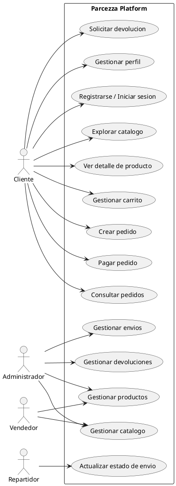

# Vista Funcional

```plantuml
@startuml
left to right direction

actor Cliente
actor Administrador
actor Vendedor
actor Repartidor

rectangle "Parcezza Platform" {
  usecase "Registrarse / Iniciar sesion" as UC1
  usecase "Explorar catalogo" as UC2
  usecase "Ver detalle de producto" as UC3
  usecase "Gestionar carrito" as UC4
  usecase "Crear pedido" as UC5
  usecase "Pagar pedido" as UC6
  usecase "Consultar pedidos" as UC7
  usecase "Solicitar devolucion" as UC8
  usecase "Gestionar perfil" as UC9
  usecase "Gestionar envios" as UC10
  usecase "Gestionar devoluciones" as UC11
  usecase "Gestionar productos" as UC12
  usecase "Gestionar catalogo" as UC13
  usecase "Actualizar estado de envio" as UC14
}

Cliente --> UC1
Cliente --> UC2
Cliente --> UC3
Cliente --> UC4
Cliente --> UC5
Cliente --> UC6
Cliente --> UC7
Cliente --> UC8
Cliente --> UC9

Administrador --> UC10
Administrador --> UC11
Administrador --> UC12
Administrador --> UC13

Vendedor --> UC12
Vendedor --> UC13

Repartidor --> UC14

@enduml
```

Notes:
- Se enfoca en las funciones principales para clientes, administracion y operacion.
- Ajusto o elimino casos de uso si quieres reflejar solo lo ya implementado.
