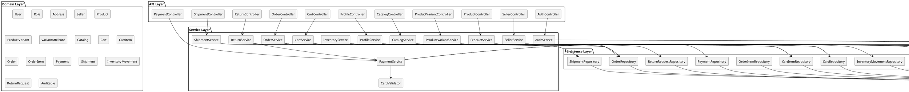

# Layer Diagram

```plantuml
@startuml
skinparam componentStyle rectangle

package "API Layer" {
  [AuthController]
  [ProductController]
  [ProductVariantController]
  [SellerController]
  [CatalogController]
  [ProfileController]
  [CartController]
  [OrderController]
  [PaymentController]
  [ShipmentController]
  [ReturnController]
}

package "Service Layer" {
  [AuthService]
  [ProductService]
  [ProductVariantService]
  [SellerService]
  [CatalogService]
  [ProfileService]
  [CartService]
  [OrderService]
  [PaymentService]
  [ShipmentService]
  [CardValidator]
  [InventoryService]
  [ReturnService]
}

package "Security Layer" {
  [JwtAuthenticationFilter]
  [JwtService]
  [UserDetailsService]
  [CurrentUserService]
}

package "Persistence Layer" {
  [UserRepository]
  [RoleRepository]
  [SellerRepository]
  [ProductRepository]
  [ProductVariantRepository]
  [VariantAttributeRepository]
  [CatalogRepository]
  [AddressRepository]
  [CartRepository]
  [CartItemRepository]
  [OrderRepository]
  [OrderItemRepository]
  [PaymentRepository]
  [ShipmentRepository]
  [InventoryMovementRepository]
  [ReturnRequestRepository]
}

package "Domain Layer" {
  [User]
  [Role]
  [Address]
  [Seller]
  [Product]
  [ProductVariant]
  [VariantAttribute]
  [Catalog]
  [Cart]
  [CartItem]
  [Order]
  [OrderItem]
  [Payment]
  [Shipment]
  [InventoryMovement]
  [ReturnRequest]
  [Auditable]
}

package "Database" {
  [PostgreSQL]
  [Flyway Migrations]
}

[AuthController] --> [AuthService]
[ProductController] --> [ProductService]
[ProductVariantController] --> [ProductVariantService]
[SellerController] --> [SellerService]
[CatalogController] --> [CatalogService]
[ProfileController] --> [ProfileService]
[CartController] --> [CartService]
[OrderController] --> [OrderService]
[PaymentController] --> [PaymentService]
[ShipmentController] --> [ShipmentService]
[ReturnController] --> [ReturnService]

[AuthService] --> [UserRepository]
[AuthService] --> [RoleRepository]
[ProductService] --> [ProductRepository]
[ProductService] --> [SellerRepository]
[ProductVariantService] --> [ProductVariantRepository]
[ProductVariantService] --> [ProductRepository]
[SellerService] --> [SellerRepository]
[SellerService] --> [RoleRepository]
[CatalogService] --> [CatalogRepository]
[CatalogService] --> [ProductRepository]
[ProfileService] --> [UserRepository]
[ProfileService] --> [AddressRepository]
[CartService] --> [CartRepository]
[CartService] --> [CartItemRepository]
[CartService] --> [ProductRepository]
[CartService] --> [ProductVariantRepository]
[OrderService] --> [OrderRepository]
[OrderService] --> [CartRepository]
[OrderService] --> [CartItemRepository]
[OrderService] --> [ShipmentRepository]
[OrderService] --> [AddressRepository]
[PaymentService] --> [PaymentRepository]
[PaymentService] --> [OrderRepository]
[PaymentService] --> [CardValidator]
[ShipmentService] --> [ShipmentRepository]
[ShipmentService] --> [OrderRepository]
[InventoryService] --> [InventoryMovementRepository]
[InventoryService] --> [ProductRepository]
[InventoryService] --> [ProductVariantRepository]
[ReturnService] --> [OrderRepository]
[ReturnService] --> [ReturnRequestRepository]
[ReturnService] --> [PaymentService]

[JwtAuthenticationFilter] --> [JwtService]
[JwtAuthenticationFilter] --> [UserDetailsService]
[CurrentUserService] --> [UserRepository]

[UserRepository] --> [PostgreSQL]
[RoleRepository] --> [PostgreSQL]
[SellerRepository] --> [PostgreSQL]
[ProductRepository] --> [PostgreSQL]
[ProductVariantRepository] --> [PostgreSQL]
[VariantAttributeRepository] --> [PostgreSQL]
[CatalogRepository] --> [PostgreSQL]
[AddressRepository] --> [PostgreSQL]
[CartRepository] --> [PostgreSQL]
[CartItemRepository] --> [PostgreSQL]
[OrderRepository] --> [PostgreSQL]
[OrderItemRepository] --> [PostgreSQL]
[PaymentRepository] --> [PostgreSQL]
[ShipmentRepository] --> [PostgreSQL]
[InventoryMovementRepository] --> [PostgreSQL]
[ReturnRequestRepository] --> [PostgreSQL]

[Flyway Migrations] --> [PostgreSQL]

@enduml
```
